# BuiltInRenderPipeline
### Rim Lighting
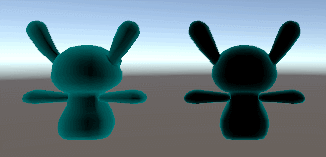

### Logical Cutoffs
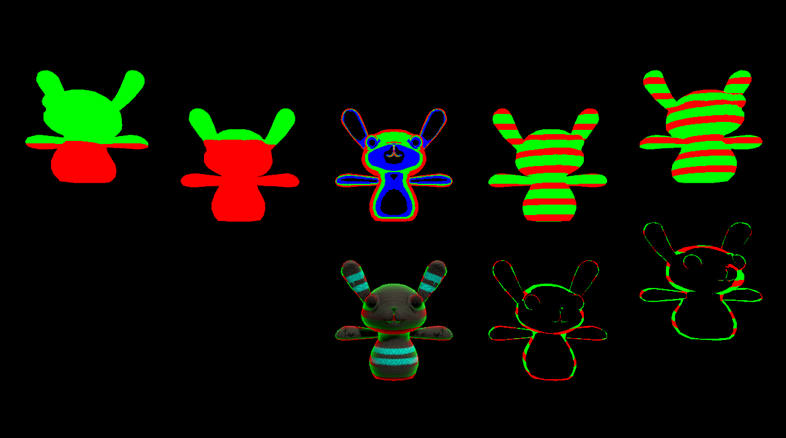

### Blinn-Phong Lighting & Surface Output
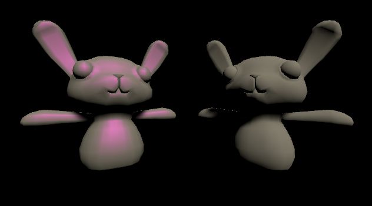

### Stencil Buffer
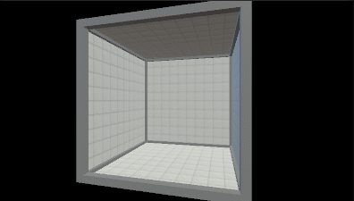

### Vertex Extruding

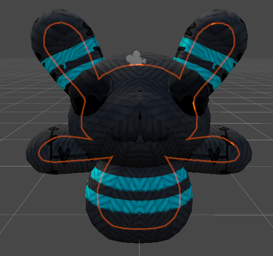

### Outlining
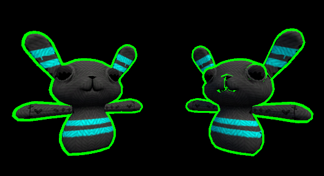

### Glass
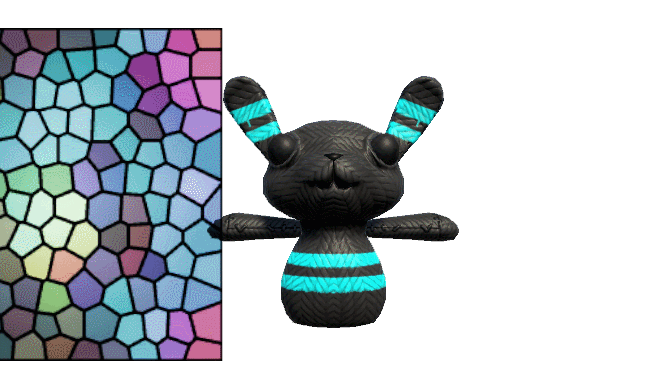

### Waves
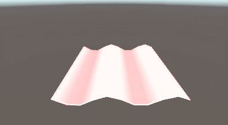
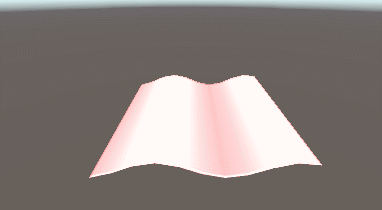
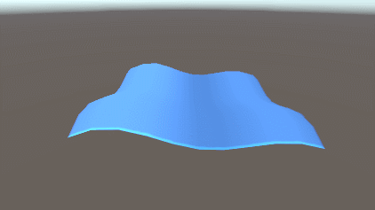

### Scrolling Textures
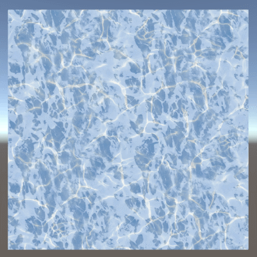