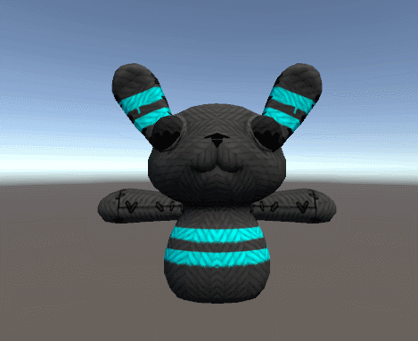

# BuiltInRenderPipeline
### Rim Lighting

### Logical Cutoffs

### Blinn-Phong Lighting & Surface Output

### Stencil Buffer

### Vertex Extruding

### Outlining

### Glass

### Waves

### Scrolling Textures
